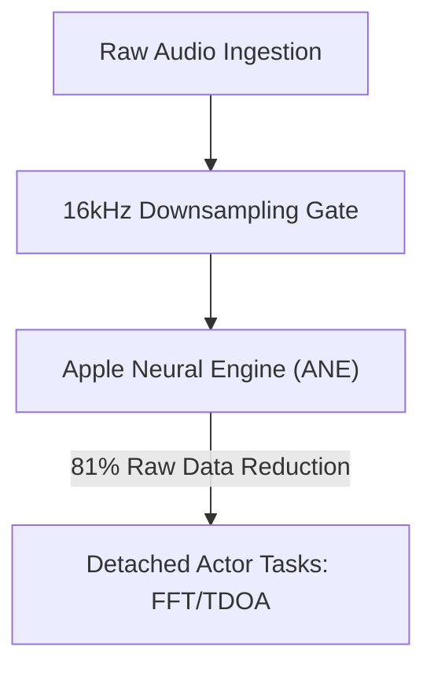

# VigilantEar 👂🛰️

**Effective Date:** May 11, 2026

**VigilantEar** is an advanced, ultra-high-performance iOS acoustic research and accessibility tool engineered to provide real-time directional and spatial awareness for the deaf and hard-of-hearing (D/HH) community. Traditional sound recognition software only identifies *what* a sound is; VigilantEar acts as a comprehensive tactical radar, combining edge-computed machine learning with sophisticated acoustic physics to track exactly *where* a sound originates, its estimated distance, and its absolute path trajectory.

---

## 🌍 Global Reach & Localization

To support users worldwide, the platform features a complete native localization matrix supporting:

- **English**
- **Spanish (Español)**
- **Chinese (简体中文)**
- **French (Français)**
- **German (Deutsch)**
- **Japanese (日本語)**

All tactical overlays, HUD alerts, and preference menus adjust dynamically to system locales.

---

## 🚀 Key Features & Capabilities

- **Smart Power Gating**: To maximize battery longevity and protect system resources, the system implements a conditional background monitor. If the five core emergency alert categories are disabled by the user, the microphone ingestion loops and processing engines automatically enter complete hibernation while backgrounded.
- **Tactical Alert Simulation**: Includes a robust on-device simulation suite allowing users to test haptic signatures and visual responses for all five critical `.emergency` tracks—Sirens, Alarms, Doorbells, People Closeby, and Severe Weather—without requiring real-world acoustic triggers.
- **Multi-Target Tracker (MTT)**: Simultaneously isolates and tracks independent environmental sound signatures using unique UUID session markers paired with physical persistence mapping.
- **Geographic Road Snapping**: Projects relative mathematical acoustic bearings onto global GPS coordinates, intelligently snapping real-time vehicle vectors to verified streets via MapKit integration.

---

## 🧬 Core Architecture & The Neural Math Engine

VigilantEar utilizes a custom **SoundML Push Architecture** built entirely around the performance and concurrency guarantees of modern iOS hardware.

## ⚡ Architectural Decoupling

To maintain a completely unblocked 120Hz UI thread while continuously handling a high-frequency input tap, the platform uses a strict separation of concerns via Swift 6 isolation:

- **MicrophoneManager (MainActor)**: Strictly isolates UI-bound properties, device orientation state, and location metrics to drive the HUD smoothly.
- **AcousticEngine (Non-Isolated / Background Actor)**: Manages low-level AVAudioEngine states and hardware operations. Ingestion buffers are deeply copied directly on the high-priority tap thread, passing snapshots straight to processing actors without ever forcing a thread-hop or stalling the Main Actor, entirely eliminating micro-stutters.

### 🧠 Mathematical Minimization

- **Offloading & Reduction**: Audio frames pass through a strict 16kHz downsampling gate before processing, slashing raw data footprints by 81% before classification vectors are processed by the Apple Neural Engine (ANE).
- **Parallel Spatial Math**: High-performance mathematical pipelines (including fast Fourier transforms (FFT), Time Difference of Arrival (TDOA) calculations, and Doppler tracking algorithms) execute entirely within detached asynchronous threads.

### 📊 Performance Benchmarks

- **Active Mode**: Delivers comprehensive live HUD tracking at a mere 6% CPU footprint across a standard 6-core processor.
- **Minimized / Background Mode**: When the application is minimized, computing drops by over 33%, sustaining absolute environmental vigilance at just 4% CPU utilization with negligible thermal impact.

---

## 🛠️ Technical Stack (2026)

- **Language**: Swift 6 (Strict concurrency, Checked Sendable models, Actor isolation)
- **Frameworks**: SwiftUI, MapKit, Accelerate Framework (vDSP), SoundML, Firebase (Firestore Telemetry)
- **Hardware Baseline**: iPhone 13 or newer (Stereo microphone alignment required for TDOA bearing precision)

---

## 📊 Privacy & Security Guardrails

- **Local-First Isolation**: All audio classifications, spectral math, and bearing projections happen exclusively on-device. Raw audio streams are never recorded, cached, or transmitted under any condition.
- **Anonymized Analytics**: Telemetry pipelines are strictly pruned to block fingerprinting vectors, transmitting only anonymous software build markers and zero-PII operational exceptions (such as unrecognized neural engine sound flags) to preserve global architectural stability.

---

## ⚖️ Disclaimer

VigilantEar is an experimental acoustic research and spatial accessibility aid. It is not certified as a life-safety utility. Tracking resolution can fluctuate dynamically based on regional topology, prevailing weather, wind conditions, and microphone hardware calibration. Users must always maintain normal environmental awareness.

**Contact Email:** [vigilantear@wingdingssocial.com](mailto:vigilantear@wingdingssocial.com)

VigilantEar is an accessibility tool built with care. Please use it responsibly.

Made with ❤️ for the D/HH community and acoustic research.

© 2026 Wingdings, Inc.  
All rights reserved.
