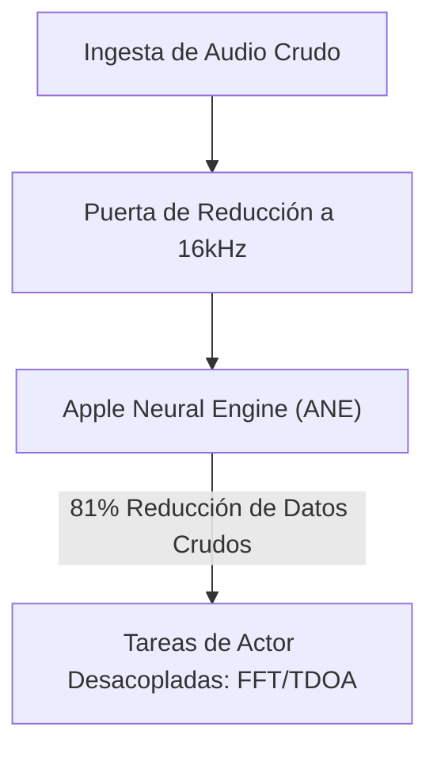

# VigilantEar 👂🛰️

**Fecha efectiva:** 11 de mayo de 2026

**VigilantEar** es una herramienta avanzada de investigación acústica y accesibilidad para iOS, de ultra alto rendimiento, diseñada para proporcionar conciencia direccional y espacial en tiempo real a la comunidad sorda y con dificultades auditivas (D/HH). Los software tradicionales de reconocimiento de sonido solo identifican *qué* es un sonido; VigilantEar actúa como un radar táctico integral, combinando aprendizaje automático computado en el dispositivo con física acústica sofisticada para rastrear exactamente *dónde* se origina un sonido, su distancia estimada y su trayectoria absoluta.

---

## 🌍 Alcance Global y Localización

Para apoyar a usuarios en todo el mundo, la plataforma cuenta con una matriz completa de localización nativa que soporta:

- **Inglés**
- **Español (Español)**
- **Chino (简体中文)**

Todos los overlays tácticos, alertas HUD y menús de preferencias se ajustan dinámicamente a los ajustes regionales del sistema.

---

## 🚀 Características y Capacidades Principales

- **Gestión Inteligente de Energía**: Para maximizar la duración de la batería y proteger los recursos del sistema, el sistema implementa un monitor de fondo condicional. Si las cinco categorías principales de alertas de emergencia están desactivadas por el usuario, los bucles de ingesta de micrófono y los motores de procesamiento entran automáticamente en hibernación completa cuando están en segundo plano.
- **Simulación de Alertas Tácticas**: Incluye un robusto conjunto de simulación en el dispositivo que permite a los usuarios probar firmas hápticas y respuestas visuales para las cinco pistas críticas `.emergency` — Sirenas, Alarmas, Timbre de puerta, Personas cercanas y Clima severo — sin necesidad de activadores acústicos del mundo real.
- ** rastreador Multi-Objetivo (MTT)**: Aísla y rastrea simultáneamente firmas de sonido ambientales independientes utilizando marcadores de sesión UUID únicos emparejados con mapeo de persistencia física.
- **Ajuste Geográfico a Carreteras**: Proyecta bearings acústicos matemáticos relativos sobre coordenadas GPS globales, ajustando inteligentemente vectores de vehículos en tiempo real a calles verificadas mediante integración con MapKit.

---

## 🧬 Arquitectura Central y Motor Matemático Neural

VigilantEar utiliza una **Arquitectura SoundML Push** personalizada construida completamente alrededor de las garantías de rendimiento y concurrencia del hardware iOS moderno.

## ⚡ Desacoplamiento Arquitectónico

Para mantener un hilo de UI a 120Hz completamente desbloqueado mientras maneja continuamente una entrada de alta frecuencia, la plataforma utiliza una estricta separación de responsabilidades mediante el aislamiento de Swift 6:

- **MicrophoneManager (MainActor)**: Aísla estrictamente las propiedades vinculadas a la UI, el estado de orientación del dispositivo y las métricas de ubicación para impulsar el HUD sin problemas.
- **AcousticEngine (Actor No Aislado / Background)**: Gestiona los estados de bajo nivel de AVAudioEngine y las operaciones de hardware. Los búferes de ingesta se copian profundamente directamente en el hilo de tap de alta prioridad, pasando instantáneas directamente a los actores de procesamiento sin forzar nunca un salto de hilo o detener el Main Actor, eliminando completamente los micro-cortes.

### 🧠 Minimización Matemática

- **Descarga y Reducción**: Los frames de audio pasan por una estricta puerta de reducción a 16kHz antes del procesamiento, reduciendo la huella de datos crudos en un 81% antes de que los vectores de clasificación sean procesados por el Apple Neural Engine (ANE).
- **Matemáticas Espaciales Paralelas**: Las tuberías matemáticas de alto rendimiento (incluyendo transformadas rápidas de Fourier (FFT), cálculos de Time Difference of Arrival (TDOA) y algoritmos de seguimiento Doppler) se ejecutan completamente dentro de hilos asincrónicos desacoplados.

### 📊 Benchmarks de Rendimiento

- **Modo Activo**: Entrega un seguimiento HUD en vivo completo con un mero 6% de uso de CPU en un procesador estándar de 6 núcleos.
- **Modo Minimizado / Segundo Plano**: Cuando la aplicación está minimizada, el cómputo cae más del 33%, manteniendo una vigilancia ambiental absoluta con solo un 4% de uso de CPU y un impacto térmico insignificante.

---

## 🛠️ Stack Técnico (2026)

- **Lenguaje**: Swift 6 (Concurrencia estricta, modelos Sendable verificados, aislamiento de Actors)
- **Frameworks**: SwiftUI, MapKit, Accelerate Framework (vDSP), SoundML, Firebase (Firestore Telemetry)
- **Base de Hardware**: iPhone 13 o más nuevo (se requiere alineación estéreo de micrófonos para precisión en bearings TDOA)

---

## 📊 Guardarraíles de Privacidad y Seguridad

- **Aislamiento Local Primero**: Todas las clasificaciones de audio, matemáticas espectrales y proyecciones de bearings ocurren exclusivamente en el dispositivo. Las transmisiones de audio crudo nunca se graban, almacenan en caché ni transmiten bajo ninguna condición.
- **Analíticas Anonimizadas**: Los pipelines de telemetría están estrictamente podados para bloquear vectores de fingerprinting, transmitiendo solo marcadores anónimos de compilación de software y excepciones operativas sin PII (como banderas de sonido no reconocidas por el neural engine) para preservar la estabilidad arquitectónica global.

---

## ⚖️ Descargo de Responsabilidad

VigilantEar es una herramienta experimental de investigación acústica y accesibilidad espacial. No está certificada como utilidad de seguridad vital. La resolución de rastreo puede fluctuar dinámicamente según la topología regional, las condiciones climáticas predominantes, el viento y la calibración del hardware del micrófono. Los usuarios deben siempre mantener una conciencia ambiental normal.

**Correo de Contacto:** [vigilantear@wingdingssocial.com](mailto:vigilantear@wingdingssocial.com)

VigilantEar es una herramienta de accesibilidad construida con cuidado. Por favor, úsala de manera responsable.

Hecho con ❤️ para la comunidad D/HH y la investigación acústica.

© 2026 Wingdings, Inc.  
Todos los derechos reservados.