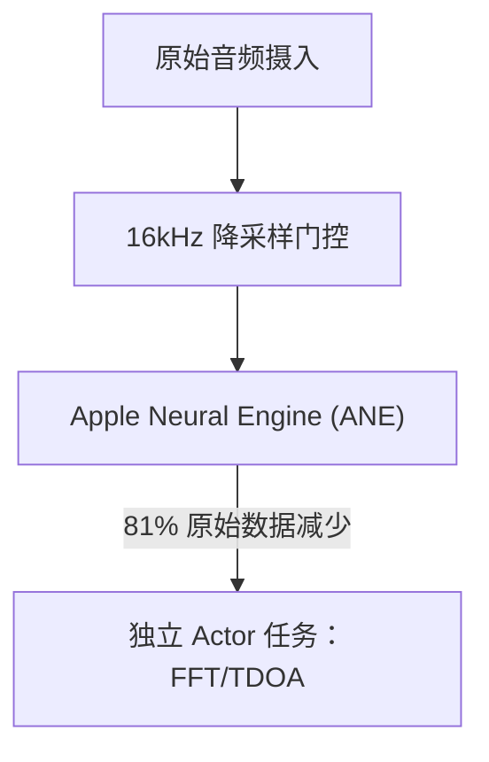

# VigilantEar 👂🛰️

**生效日期：** 2026年5月11日

**VigilantEar** 是一款先进的、超高性能 iOS 声学研究与无障碍工具，专为失聪和听力障碍（D/HH）群体设计。它能够提供实时的方向和空间感知能力。传统的声音识别软件只能识别*是什么*声音；而 VigilantEar 则像一个全面的战术雷达，结合边缘计算机器学习和复杂的声学物理学，能够精确追踪声音的*来源位置*、估计距离以及绝对运动轨迹。

---

## 🌍 全球覆盖与本地化

为了支持全球用户，本平台提供完整的原生本地化支持，包括：

- **英语**
- **西班牙语（Español）**
- **简体中文**

所有战术叠加层、HUD警报和偏好设置菜单会根据系统语言动态调整。

---

## 🚀 主要功能与特性

- **智能电源门控**：为最大化电池续航和保护系统资源，当用户禁用五类核心紧急警报时，麦克风采集循环和处理引擎会在应用进入后台时自动完全休眠。
- **战术警报模拟**：内置强大的设备端模拟套件，允许用户在无需真实声音触发的情况下，测试五类关键 `.emergency` 音轨（警笛、闹钟、门铃、附近人员、恶劣天气）的触觉反馈和视觉响应。
- **多目标跟踪器 (MTT)**：可同时隔离并跟踪多个独立的环境声音特征，每个使用唯一的 UUID 会话标记并结合物理持久性映射。
- **地理道路吸附**：将相对的声学方位数学投影到全局 GPS 坐标上，通过 MapKit 智能地将实时车辆向量吸附到已验证的街道上。

---

## 🧬 核心架构与神经数学引擎

VigilantEar 使用专为现代 iOS 硬件的性能和并发保证而定制的 **SoundML Push 架构**。

## ⚡ 架构解耦

为了在持续处理高频输入的同时保持完全不阻塞的 120Hz UI 线程，本平台通过 Swift 6 隔离实现了严格的关注点分离：

- **MicrophoneManager (MainActor)**：严格隔离 UI 相关属性、设备方向状态和位置指标，以流畅驱动 HUD 显示。
- **AcousticEngine (Non-Isolated / Background Actor)**：管理底层 AVAudioEngine 状态和硬件操作。采集缓冲区在高优先级 tap 线程上直接深度复制，将快照直接传递给处理 Actor，完全避免线程跳转或阻塞 Main Actor，从而消除微卡顿。

### 🧠 数学最小化

- **卸载与数据缩减**：音频帧在处理前会通过严格的 16kHz 降采样门控，将原始数据量减少 81%，然后再由 Apple Neural Engine (ANE) 处理分类向量。
- **并行空间数学**：高性能的数学管线（包括快速傅里叶变换 (FFT)、到达时间差 (TDOA) 计算和多普勒跟踪算法）完全在独立的异步线程中执行。

### 📊 性能基准

- **主动模式**：在标准 6 核处理器上仅占用 6% CPU 即可提供全面的实时 HUD 跟踪。
- **最小化 / 后台模式**：应用最小化后，计算量下降超过 33%，以仅 4% CPU 利用率维持绝对环境警戒，同时热影响极小。

---

## 🛠️ 技术栈 (2026)

- **语言**：Swift 6（严格并发、Checked Sendable 模型、Actor 隔离）
- **框架**：SwiftUI、MapKit、Accelerate Framework (vDSP)、SoundML、Firebase (Firestore Telemetry)
- **硬件要求**：iPhone 13 或更新机型（TDOA 方位精度需要立体麦克风对齐）

---

## 📊 隐私与安全防护

- **本地优先隔离**：所有音频分类、频谱计算和方位投影均完全在设备上进行。原始音频流在任何情况下都不会被录制、缓存或传输。
- **匿名化分析**：遥测管线经过严格裁剪以阻止指纹识别，仅传输匿名的软件构建标记和零 PII 的操作异常（例如未识别的神经引擎声音标记），以维护全局架构稳定性。

---

## ⚖️ 免责声明

VigilantEar 是一款实验性的声学研究和空间无障碍辅助工具。它并未被认证为生命安全设备。跟踪分辨率会因区域地形、当前天气、风力条件和麦克风硬件校准而动态波动。用户必须始终保持正常的周围环境意识。

**联系邮箱：** [vigilantear@wingdingssocial.com](mailto:vigilantear@wingdingssocial.com)

VigilantEar 是一款用心打造的无障碍工具。请负责任地使用它。

Made with ❤️ for the D/HH community and acoustic research.

© 2026 Wingdings, Inc.  
All rights reserved.